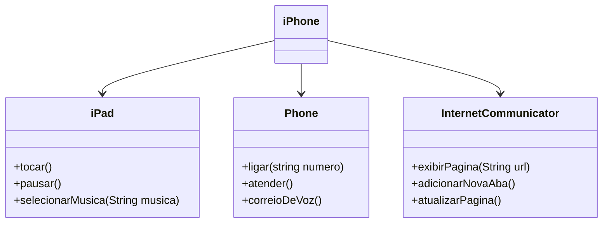

# Modelagem e Diagramação UML dos componentes do iPhone

```mermaid
classDiagram
    class iPad {
        +tocar()
        +pausar()
        +selecionarMusica(String musica)
    }

    class Phone {
        +ligar(string numero)
        +atender()
        +correioDeVoz()
    }

    class InternetCommunicator {
        +exibirPagina(String url)
        +adicionarNovaAba()
        +atualizarPagina()
    }

    class iPhone {
    }

    iPhone --> iPad
    iPhone --> Phone
    iPhone --> InternetCommunicator
```